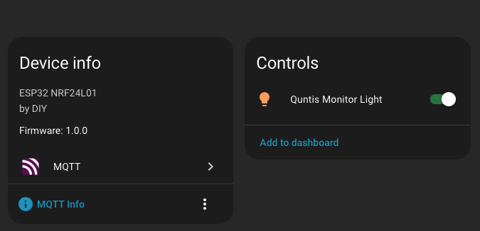

# What

What is it? It's a DIY remote controller for the Quntis Monitor Light Bar PRO+ (Typenr.: LI-HY-208-BK). This light bar can be used to lit the desk in front of your monitor. It comes with a remote controller to turn it on/off and control the dimming and light color:  

I do have this same lamp and wished I could integrate this into my HomeAssistant. So based on the Original Implementation of [Lexy1972](https://github.com/Lexy1972/Reverse-Engineer-a-Quntis-Monitor-LED-Bar-Controller) I migrated the code to an ESP32 to be able to publish the state to an MQTT Server so HomeAssistant can pick it up.

And also added a small WebUI to it in case you don't use HomeAssistant but wish you could control it via MQTT or a WebUI.

The Implementation was a fun ride as nothing worked in the beginning and I thought my NRF24L01 modules are broken or that the protocol on my model is entirely different and I had to go the same length as they did figuring out the protocol. Fear not as it was as much work. As written in the [original README](#controller-using-rfnano-nrf24l01), this part is crucial:

> Here are the address and the fixed part of the data defined. I don't know if this is universal for all devices (probably not).

So I tried multiple ways of figuring out the address of my own remote. In the end I found a very "simple" way to get the address of your own remote - For this you don't need extra hardware, your ESP32 with the NRF24L01 is enough. 

Flash the Firmware found in the [Quntis Sniffer](https://github.com/bluemaex/Quntis-LED-Controller/tree/main/arduino/Quntis%20Sniffer) and run it. Then press your remote a few times to (hopefully) see the adress of your Remote printed. With this Adress you can now update the Remote Address in `QuntisControl.h` of the ported code and you should be able to control your Quintis Desk Lamp with MQTT/HomeAssistant!

The new ESP32 you can find next to the Arduino Version: https://github.com/bluemaex/Quntis-LED-Controller/blob/main/arduino/Quntis%20ESP32_MQTT
The WebUI itself you have to flash separately on the SPIFFS Filesystem with `pio run -e esp32dev -t uploadfs` or using the PlatformIO VS Code Extension.

Please definitely read the original [README.md](https://github.com/Lexy1972/Reverse-Engineer-a-Quntis-Monitor-LED-Bar-Controller/tree/main/README.md) to understand this project and the amount of work [Lexy1972](https://github.com/Lexy1972/Reverse-Engineer-a-Quntis-Monitor-LED-Bar-Controller) put in it. 

