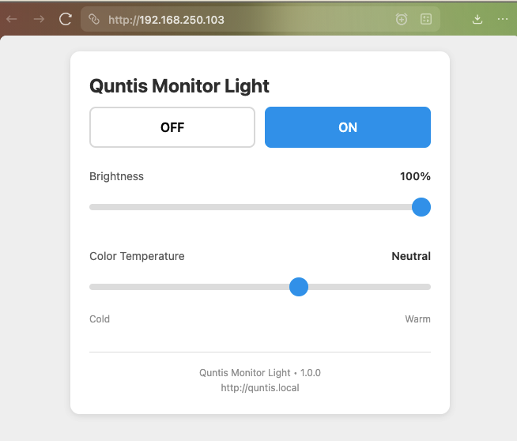
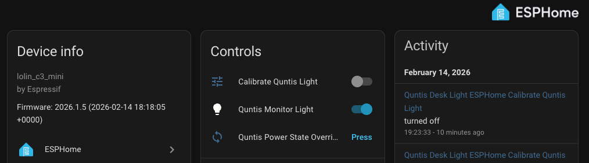

# What

What is it? It's a DIY remote controller for the Quntis Monitor Light Bar PRO+ (Typenr.: LI-HY-208-BK). This light bar can be used to lit the desk in front of your monitor. It comes with a remote controller to turn it on/off and control the dimming and light color:  


I do have this same lamp and wished I could integrate this into my HomeAssistant. So based on the Original Implementation of [Lexy1972](https://github.com/Lexy1972/Reverse-Engineer-a-Quntis-Monitor-LED-Bar-Controller) I migrated the code to be able to run it on an ESP32.

The Implementation was a fun ride as nothing worked in the beginning and I thought my NRF24L01 modules are broken or that the protocol on my model is entirely different and I had to go the same length as they did figuring out the protocol. Then I saw the sentence in the [original README](#controller-using-rfnano-nrf24l01), this part is crucial:

> Here are the address and the fixed part of the data defined. I don't know if this is universal for all devices (probably not).

So I tried multiple ways of figuring out the address of my own remote. After a lot of tries to find out my remote address, and having lots of wrong results and noise I found a very "simple" way to get the address of your own remote - For this you don't need extra hardware, your ESP32 with the NRF24L01 is enough.

Please definitely read the original [README.md](https://github.com/Lexy1972/Reverse-Engineer-a-Quntis-Monitor-LED-Bar-Controller/tree/main/README.md) to understand this project and the amount of work [Lexy1972](https://github.com/Lexy1972/Reverse-Engineer-a-Quntis-Monitor-LED-Bar-Controller) put in it.

## Step 1: Spy on your own remote

To capture it, wire up your NRF24L01 module using the following pins if you use a [ESP32-C3 Super Mini](https://www.amazon.de/dp/B0DMN6VKNN):

```
CE=GPIO1
CS=GPIO5
CLK=GPIO2
MOSI=GPIO4
MISO=GPIO3
```

To capture the address, open the [Quntis Sniffer](https://github.com/bluemaex/Quntis-LED-Controller/tree/main/arduino/Quntis%20Sniffer) Project in the PlatformIO IDE. 
Compile and flash it to the ESP32. This is a very barebone image that does not start any Wifi to avoid as many noise in the 2.4 Ghz Band while sniffing.

Open the Serial monitor at **115200 baud** - the PlatformIO IDE built-in one works fine, or if you prefer a browser go to [terminal.spacehuhn.com](https://terminal.spacehuhn.com/). 

Hold your remote as close to the NRF24L01 as possible and smash the remote button repeatedly. The Quntis remote sends 6 identical packets in a burst per button press and when we detects these duplicate packets we print the decoded packet to the console:

```
Duplicate packet detected (10ms apart)!
────────────────────────────────────
  Raw:     49 80 4A CB A5 BC 8B 3F 81 FC 88 CF E5
  Address: 0x20 0x21 0x01 0x31 0xAA
  Data:    0x00 0x76 0x9A 0x31 0x4A 0x20
```

The `Address:` line is what you want. Copy those five hex values — that's your remote address.

If nothing shows up after a lot of button pressing, try holding the remote closer (practically touching the antenna), or restart the sniffer with `r` in the serial monitor and try again. The RF signal is weak and proximity matters. 


## Step 2: Choose your version

### MQTT Version

In the beginning it was easier to add MQTT And Wifi to the original project and leave everything as is. So use this version if you do not use HomeAssistant or wish to primarely control it through MQTT.

Open the [MQTT Project](https://github.com/bluemaex/Quntis-LED-Controller/tree/main/arduino/Quntis%20ESP32_MQTT) in the PlatformIO IDE and open the file `arduino/Quntis ESP32_MQTT/src/QuntisControl.h`

You need to update your device address
```cpp
byte _address[ADDRESS_LENGTH] = {0x20, 0x21, 0x01, 0x31, 0xAA};
```

and then flash the code to the same ESP32.
The WebUI itself you have to flash separately on the SPIFFS Filesystem with `pio run -e esp32dev -t uploadfs` or using the IDE.



If you use HomeAssistant it is picked up automatically as a light.

## ESPHome Setup

Since I control most of my devices via ESPHome I was intrigued to see if it is possible to migrate this to ESPHome. Since there is no official support of NRF24L01 in ESPHome, the only way to get it to work is via the Arduino Subsystem plugin.

To use this version copy [`example-esphome-config.yaml`](example-esphome-config.yaml) as a starting point for your ESPHome device. The only thing you *must* change is the `device_address` field — replace the placeholder with the address you just captured before.

```yaml
device_address: [0x20, 0x21, 0x01, 0x31, 0xAA]
```

The PIN configuration is the same as for the flasher so you don't have to change it if you use the same chip.

Now it is time to compile the ESPHome Version. Be aware it takes quite a bit longer than a normal ESPHome compilation. After flashing Home Assistant should discover the new Device. Adopt it and go to the new Device Details. The ESP has no way to know the light's current state on first boot, so toggle the Power on and off, as in the beginning it might have a wrong state. 

Make sure it is on then press the **Calibrate** switch. This calibration walks it through a full cycle of color and brightness to sync up. You only need to do this once — or any time the state gets confused after a power cut or if you use the original remote.




Have fun and enjoy your new smart light 💡🎉

